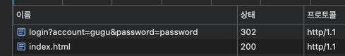
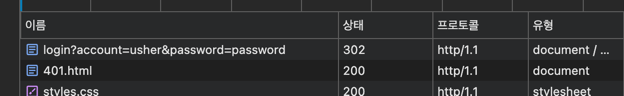

# 2단계 - 로그인 구현하기

## 1. 로그인 후 다른 페이지 이동시키기
- [x] 로그인 성공 시 302 반환 및 `/index.html`로 리다이렉트

- [x] 로그인 실패 시 `/401.html`로 리다이렉트


## 2. POST 방식 도입
- [x] `http://localhost:8080/register` 접속 시 `register.html` 보여주고 GET 사용
- [x] 회원가입 버튼 누를 시 `POST` 요청 사용
- [x] 회원가입 완료 시 `/index.html`로 리다이렉트
- [x] 로그인 페이지 버튼 클릭 시 `POST` 요청 사용

## 3. Cookie에 JSESSIONID 값 저장
- [ ] 로그인 성공 후 쿠키와 세션을 활용해 로그인 상태 유지하기
- [ ] HTTP 서버에서 JSESSIONID 이름 세션 저장하기
- [ ] 응답 전달 시 응답 헤더 `Set-Cookie` 추가
- HTTP Request Header 예시
    ```aiignore
    GET /index.html HTTP/1.1
    Host: localhost:8080
    Connection: keep-alive
    Accept: */*
    Cookie: yummy_cookie=choco; tasty_cookie=strawberry; JSESSIONID=656cef62-e3c4-40bc-a8df-94732920ed46
    ```
- HTTP Response Header 예시
    ```aiignore
    HTTP/1.1 200 OK 
    Set-Cookie: JSESSIONID=656cef62-e3c4-40bc-a8df-94732920ed46
    Content-Length: 5571
    Content-Type: text/html;charset=utf-8;
    ```
  
## 4. Session 구현하기
- [ ] 쿠키에서 받은 JSESSIONID의 값으로 로그인 체크 여부 확인
- [ ] 로그인 성공 시 Session 객체의 값 User 객체 저장
- [ ] 로그인 상태에서 /login 페이지 접근 시 `/index.html` 페이지 리다이렉트
