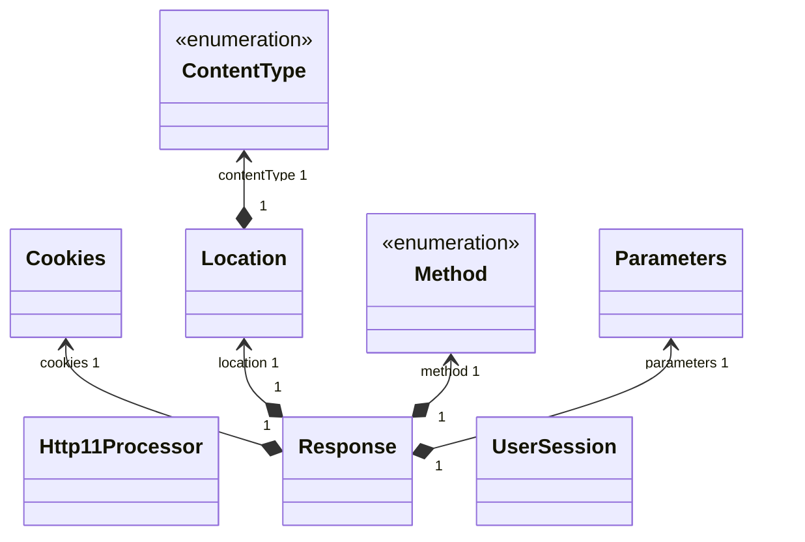

# 톰캣 구현하기

### 기능 명세

- [x] GET /index.html 응답
- [x] CSS 지원
- [x] Query String 파싱
    - 로그인 메서드 GET -> POST 변경 여부에 따라 제거
- [x] 로그인 여부에 따른 리다이렉트
- [x] 회원가입
- [x] JSESSIONID 쿠키를 사용한 유저 세션 구현

### 구조

