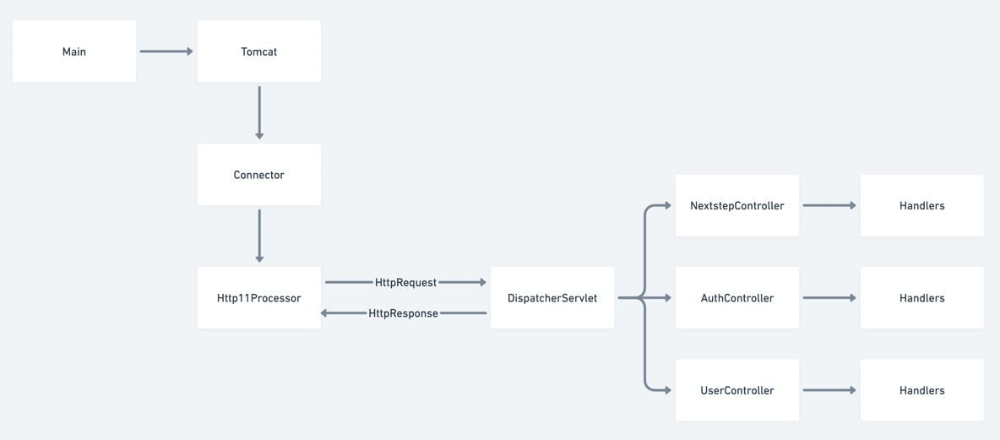

    

# Tomcat 구현하기

---

> 우아한테크코스 웹 백엔드 4기, Tomcat 구현하기 저장소입니다.

  

## 기능 구현 목록

---

### 1단계 - HTTP 서버 구현하기

- [x] GET /index.html 응답하기 (http://localhost:8080/index.html)
- [x] CSS 지원하기 (http://localhost:8080/index.html)
- [x] Query String 파싱 (http://localhost:8080//login?account=gugu&password=password)

 

### 2단계 - 로그인 구현하기

- [x] HTTP Status Code 302 (http://localhost:8080/login)
- [x] POST 방식으로 회원가입 (http://localhost:8080/register)
- [x] Cookie에 JSESSIONID 값 저장하기 (http://localhost:8080/login)
- [x] Session 구현하기 (http://localhost:8080/login)

 

### 3단계 - 리팩터링

- [x] HttpRequest 클래스 구현하기
- [x] HttpResponse 클래스 구현하기
- [x] Controller 인터페이스 추가하기

 

### 4단계 - 동시성 확장하기

- [x] Executors로 Thread Pool 적용
- [x] 동시성 컬렉션 사용하기

 

## 도메인

### Http11Processor

> HTTP Message를 파싱하여 요청을 서블릿에게 전달하고,  HTTP Message를 write하여 클라이언트에게 응답처리

- Socket의 Connection으로부터 InputStream, OutputStream을 준비
- InputStream에 담긴 HttpMessage를 HttpRequest로 파싱
- 요청을 처리할 수 있는 서블릿을 확인하여 HttpRequest를 전달
- 응답된 HttpResponse의 String을 OutputStream으로 write

 

### DispatcherServlet

> 서블릿 컨테이너에 등록되는 단 하나의 서블릿   핸들러들 목록을 가지고 요청을 분기하여 전달함

- Servlet 인터페이스를 구현하여 서블릿 컨테이너에 하나의 서블릿으로서 등록됨
- support 메서드가 모든 요청에 대해 true를 반환함으로써, 모든 요청을 처리함
- doService 메서드에서 해당 요청을 처리할 핸들러를 찾아 HttpRequest를 전달함

 

### Handlers (Controller, RequestMapping)

> 개발자들이 비즈니스 로직을 작성하게 될 실제 요청을 처리하는 곳

- Controller 애너테이션이 선언된 클래스 내에 RequestMapping 애너테이션이 있는 메서드들이 핸들러로 등록됨
- HttpRequest를 매개변수로 받고, HttpResponse를 반환값으로 선언
- 실제 요청을 받아 처리할 내용들이 작성되는 곳

 

### CustomReflectionUtils

> 레이어간 의존성 분리를 위해 사용   런타임에 특정 인터페이스, 또는 애너테이션을 통해 클래스 정보를 불러와 인스턴스화하는데 사용

- 서블릿과 디스패처 서블릿, 디스패처 서블릿과 핸들러들의 의존성을 분리하기 위해 사용
- 서블릿은 런타임에 Servlet을 구현한 클래스들의 정보를 가져와서 인스턴스화 한 뒤 서블릿 컨테이너에 등록함
- 디스패처 서블릿은 런타임에 Controller, RequestMapping 애너테이션 정보를 통해 핸들러들을 인스턴스화한 뒤 정보를 상태값으로 보유
- 요청이 올 때 요청 정보중 일부를 이용해 해당 요청할 처리할 핸들러를 찾음

  
