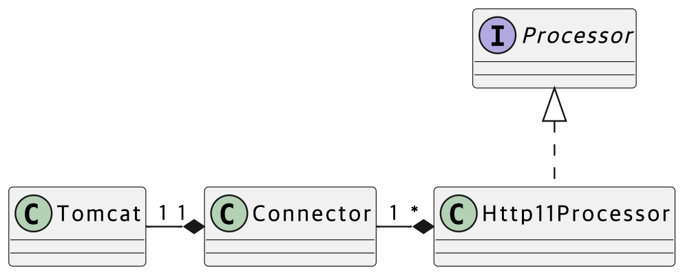

# 톰캣 구현하기

- HTTP와 서블릿에 대한 이해도를 높인다.
- 스레드, 스레드풀을 적용해보고 동시성 처리를 경험한다.

### 클래스 다이어그램

### 미션 일정

> 마감 시간은 18:00으로 고정

- 9/2 (금) 첫 PR 요청
- 9/6 (화) 첫 PR 전체 머지
- 9/8 (금) 마지막 PR 요청
- 9/13 (화) 마지막 PR 전체 머지

# 1단계

### 기능 요구사항

- GET /index.html 응답하기
- CSS 지원하기
- Query String 파싱

### 체크리스트

- [ ] http://localhost:8080/index.html 페이지에 접근 가능하다.
- [ ] 접근한 페이지의 js, css 파일을 불러올 수 있다.
- [ ] uri의 QueryString을 파싱하는 기능이 있다.
