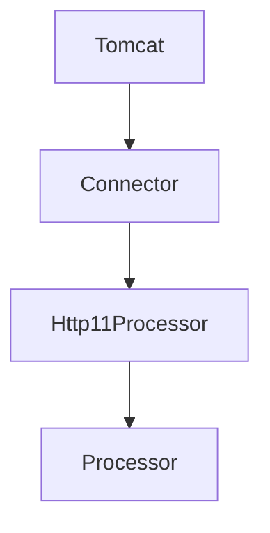

# 톰캣 구현하기

## 현재 구조

### Tomcat
- start() 메서드가 호출되면 `connector를 하나 생성`한다.
  - connector를 하나 생성한 이후 `start`한다.
  - connector 객체는 Runnable을 구현한 객체로 쓰레드마다 할당된다
- 이후 `콘솔을 통해 아무 값이나 입력`을 받는 경우에는 `connector를 stop`하고 종료한다. 

### Connector
- ServerSocket과 stopped를 필드로 가지고 있다.
  - 처음 Connector 객체를 생성할 때 ServerSocket를 하나 생성하고,stopped를 false로 둔다.
  - ServerSocket은 클라이언트의 요청을 전달받는(accept) 역할을 한다.
- start 메소드가 호출되면 현재 Connector 객체를 쓰레드에 할당한다.
  - Runnable 인터페이스를 구현했기에 run 메소드를 오버라이드해서 쓰레드의 동작을 설정할 수 있다.
  - stopped가 false이면 계속 connect()를 호출한다.
- ServerSocket이 연결되면 `Http11Processor를 생성`하여 이를 쓰레드에 할당하여 시작한다.
- stop 메소드가 호출되면 stopped를 true로 바꾸고 serverSocket을 닫는다.

### Http11Processor
- 연결이 된다면 inputStream과 outputStream을 생성하여 외부의 요청을 처리한다.
  - inputStream을 통해 클라이언트의 요청을 전달받는다.
  - outputStream을 통해 클라이언트에게 응답한다.

# 1. HTTP 서버 구현하기
## 클라이언트가 index.html 엔드포인트에 접근하면 html 문서를 전달한다.

### 요구사항을 만족시키기 위해 필요한 기능
- 클라이언트의 요청에서 자원의 경로를 파싱하는 기능
- 클라이언트가 요청한 자원이 서버에 존재하는지 확인하는 기능
  - 자원이 있다면 이를 리턴
  - 자원이 없다면 존재하지 않는 url임을 알려주는 값 리턴
