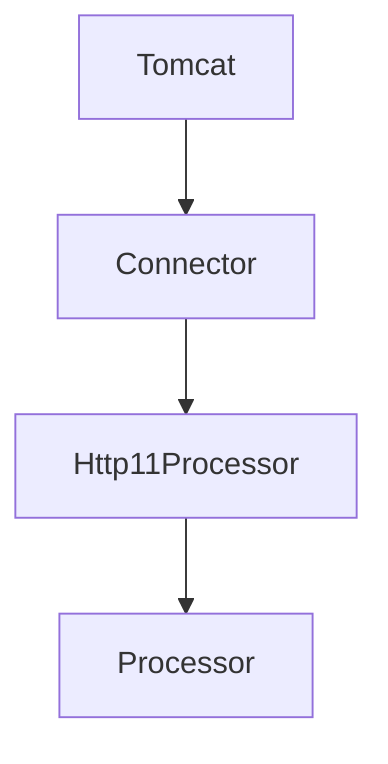

# 톰캣 구현하기

## 현재 구조

### Tomcat
- start() 메서드가 호출되면 `connector를 하나 생성`한다.
  - connector를 하나 생성한 이후 `start`한다.
  - connector 객체는 Runnable을 구현한 객체로 쓰레드마다 할당된다
- 이후 `콘솔을 통해 아무 값이나 입력`을 받는 경우에는 `connector를 stop`하고 종료한다. 

### Connector
- ServerSocket과 stopped를 필드로 가지고 있다.
  - 처음 Connector 객체를 생성할 때 ServerSocket를 하나 생성하고,stopped를 false로 둔다.
  - ServerSocket은 클라이언트의 요청을 전달받는(accept) 역할을 한다.
- start 메소드가 호출되면 현재 Connector 객체를 쓰레드에 할당한다.
  - Runnable 인터페이스를 구현했기에 run 메소드를 오버라이드해서 쓰레드의 동작을 설정할 수 있다.
  - stopped가 false이면 계속 connect()를 호출한다.
- ServerSocket이 연결되면 `Http11Processor를 생성`하여 이를 쓰레드에 할당하여 시작한다.
- stop 메소드가 호출되면 stopped를 true로 바꾸고 serverSocket을 닫는다.

### Http11Processor
- 연결이 된다면 inputStream과 outputStream을 생성하여 외부의 요청을 처리한다.
  - inputStream을 통해 클라이언트의 요청을 전달받는다.
  - outputStream을 통해 클라이언트에게 응답한다.

# 요구사항
## 0. 이전 미션에서 추가적으로 진행할 요구사항
- [x] 메인 홈 페이지가 입력되는 경우에는 문자열을 그대로 전달한다. (기존코드로 수정)
  - 웹서버의 리턴 값의 타입이 다양할 수 있다는 것을 학습하기 위해 문자열을 전달했던 것으로 보임
  - 따라서 기존 코드 형태로 다시 변경하고자함
- [x] 문자열과 file resource를 전달할 수 있다.

## 1. HTTP Status Code 302
- 로그인을 한다면 302 상태 코드와 함께 index.html 페이지로 이동한다.
- 로그인에 실패한다면 401 상태 코드와 함께 401.html 페이지로 이동한다.

### 요구사항을 만족시키기 위해 필요한 기능
- [x] 핸들러를 통해 로그인 여부를 확인할 수 있다.
- [x] 로그인 여부에 따라 다른 페이지를 전달할 수 있다.

## 2. POST 방식으로 회원가입
- 회원가입을 할 수 있다. 
  - 회원가입 버튼을 누르면 POST를 사용한다.
- 로그인 페이지에서 버튼을 누르면 POST를 사용한다.

### 요구사항을 만족시키기 위해 필요한 기능
- [x] register로 접속하면 회원가입 페이지를 보여준다.
- [x] 회원가입을 할 수 있다.
- [x] 회원가입과 로그인을 POST로 변경한다.
- [x] 요청에서 Request Body를 파싱할 수 있다.

## 3. Cookie에 JSESSIONID 값 저장하기
- JSESSIONID 쿠키를 추가해 클라이언트에게 전달할 수 있다.

### 요구사항을 만족시키기 위해 필요한 기능
- [x] Set-Cookie에 JSESSIONID를 담아 보낸다.
  - [x] 로그인에 성공하면 Set-Cookie에 JSESSIONID를 전달한다.

## 4. Session 구현하기
- 쿠키에서 전달받은 JSESSIONID의 값으로 로그인 여부를 체크할 수 있다.

### 요구사항을 만족시키기 위해 필요한 기능
- [x] 세션을 이용해 로그인 여부를 확인할 수 있다.
  - [x] 세션에 저장된 JSESSIONID를 전달하면 로그인에 성공한다.
  - [x] 세션에 저장되지 않은 JSESSIONID를 전달한 경우에는 예외가 발생한다.
- [x] 로그인에 성공하면 Session 객체의 값으로 User 객체를 저장한다.
  - [x] <JSESSIONID: User>의 형태로 구성한다.
- [x] 로그인한 상태에서 /login 페이지에 GET Method로 접근하면 index.html 페이지로 리다이렉트 처리한다.

# 3. 리팩토링
## 리팩토링 사항
- [ ] 각 레이어별 커스텀 예외 구현
- [ ] response, request header view mapper 구현
- [ ] response resolver에 request가 안넘어가도록 구현
- [ ] controller, adapter 구조 분리
  - [ ] controller, adapter 추상화 및 역할 구분
- [x] request, response 객체 내 map에서 key에 해당하는 value가 없더라도 null 반환하도록 모두 변경 
