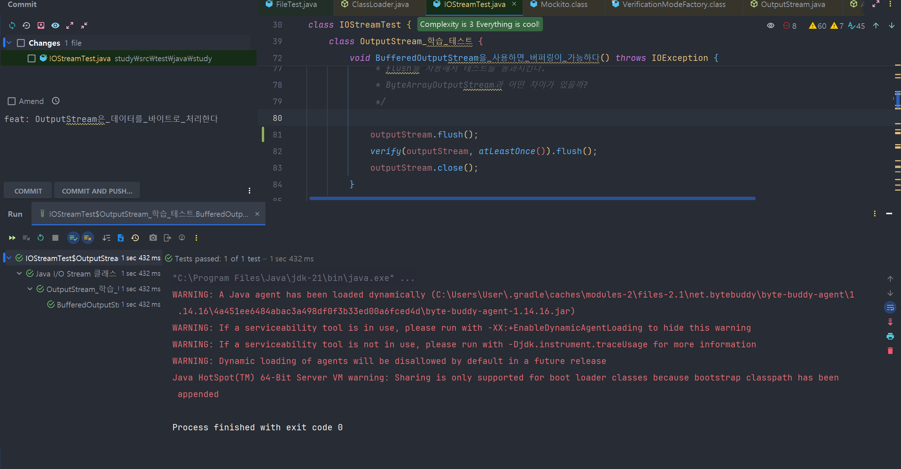
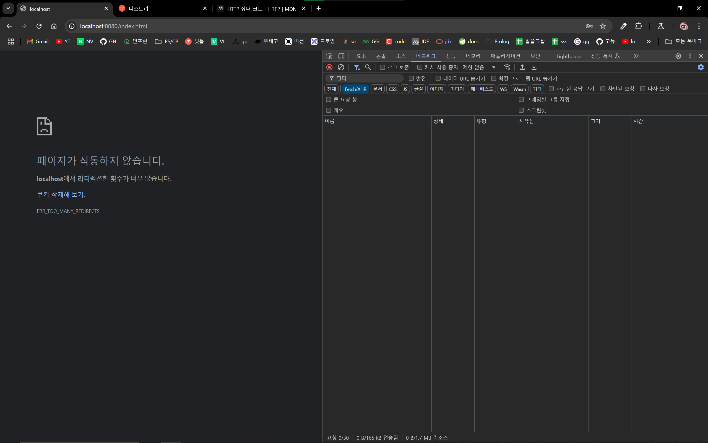
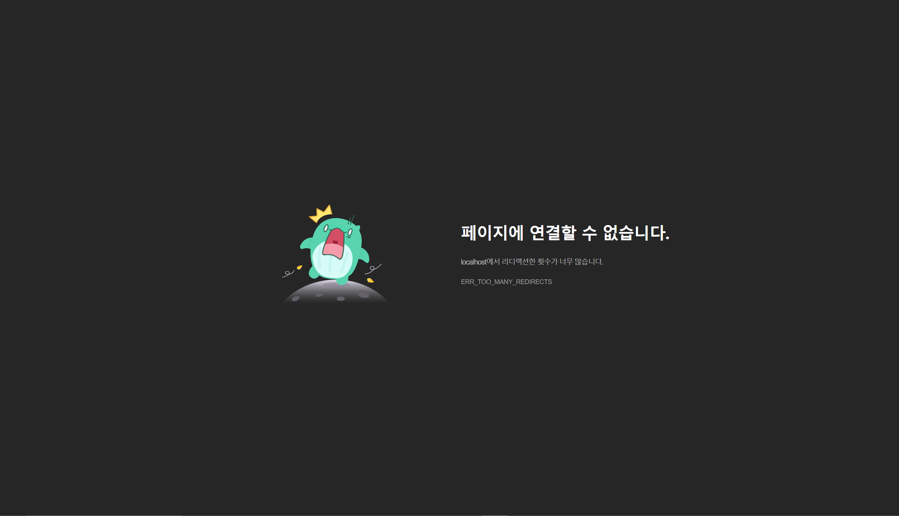
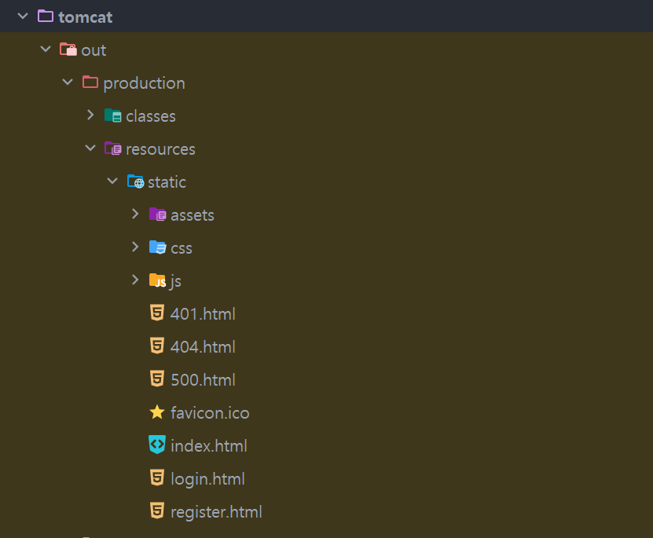

# 레벨 4 미션

### 질문
* [테스트](study.IOStreamTest.OutputStream_학습_테스트.BufferedOutputStream을_사용하면_버퍼링이_가능하다)를 수행하는데 아래와 같은 WARNING이 발생하였다. 무엇일까?
알아보자.  

```text
WARNING: A Java agent has been loaded dynamically (C:\Users\User\.gradle\caches\modules-2\files-2.1\net.bytebuddy\byte-buddy-agent\1.14.16\4a451ee6484abac3a498df0f3b33ed00a6fced4d\byte-buddy-agent-1.14.16.jar)
WARNING: If a serviceability tool is in use, please run with -XX:+EnableDynamicAgentLoading to hide this warning
WARNING: If a serviceability tool is not in use, please run with -Djdk.instrument.traceUsage for more information
WARNING: Dynamic loading of agents will be disallowed by default in a future release
Java HotSpot(TM) 64-Bit Server VM warning: Sharing is only supported for boot loader classes because bootstrap classpath has been appended
```


* BufferedOutputStream와 ByteArrayOutputStream의 차이
* inputStream에서 바이트로 반환한 값을 문자열로 어떻게 바꿈
  * [참고](https://www.baeldung.com/convert-input-stream-to-string)
* 버퍼 크기를 지정하지 않으면 버퍼의 기본 사이즈는 얼마일까?
  * DEFAULT_BUFFER_SIZE = 8192 (2^13)
* while (true) 대신 for(; ;) 사용하는 이유가 뭘까? [코드](java.io.BufferedInputStream.implRead(byte[], int, int))


* bufferedReader.lines().toList()로는 안불러지고 bufferedReader.readline()으로 해결
* 리다이렉트 하기 위해서 Location을 지정해주는데 302일 때는 제대로 되고 401일 때는 리다이렉트가 안됨 
  * 어떤 메서드에서만 리다이렉트가 가능한가?
  * 몰리왈 3xx만 리다이렉트
    * 하지만 아니었고
    * 301과 302 됨
    * 300 안됨
    * 308 하니까 에러뜸
  * 
  * 
  * 

* 실수로 tomcat/src/resources/login.html이 아닌 /tomcat/out/resources/login.html을 변경했다
  * 그래도 변경이 반영됐는데 왜일까?
    * 추측 out은 src를 기반으로 만드는 소스코드이고, 결국 프로그램이 바라보는건 out 파일이니 src 변경 없이 out을 변경해도 제대로 동작하는건가

