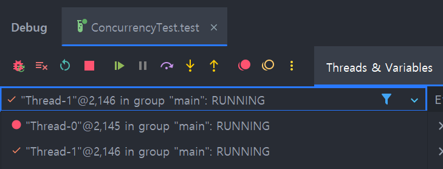
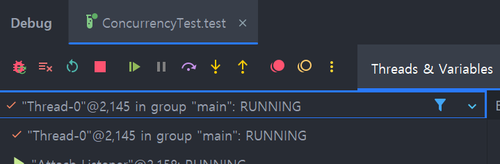

# 레벨 4 미션

### 질문
* [테스트](study.IOStreamTest.OutputStream_학습_테스트.BufferedOutputStream을_사용하면_버퍼링이_가능하다)를 수행하는데 아래와 같은 WARNING이 발생하였다. 무엇일까?
알아보자.  

```text
WARNING: A Java agent has been loaded dynamically (C:\Users\User\.gradle\caches\modules-2\files-2.1\net.bytebuddy\byte-buddy-agent\1.14.16\4a451ee6484abac3a498df0f3b33ed00a6fced4d\byte-buddy-agent-1.14.16.jar)
WARNING: If a serviceability tool is in use, please run with -XX:+EnableDynamicAgentLoading to hide this warning
WARNING: If a serviceability tool is not in use, please run with -Djdk.instrument.traceUsage for more information
WARNING: Dynamic loading of agents will be disallowed by default in a future release
Java HotSpot(TM) 64-Bit Server VM warning: Sharing is only supported for boot loader classes because bootstrap classpath has been appended
```


* BufferedOutputStream와 ByteArrayOutputStream의 차이
* inputStream에서 바이트로 반환한 값을 문자열로 어떻게 바꿈
  * [참고](https://www.baeldung.com/convert-input-stream-to-string)
* 버퍼 크기를 지정하지 않으면 버퍼의 기본 사이즈는 얼마일까?
  * DEFAULT_BUFFER_SIZE = 8192 (2^13)
* while (true) 대신 for(; ;) 사용하는 이유가 뭘까? [코드](java.io.BufferedInputStream.implRead(byte[], int, int))


* bufferedReader.lines().toList()로는 안불러지고 bufferedReader.readline()으로 해결
* 리다이렉트 하기 위해서 Location을 지정해주는데 302일 때는 제대로 되고 401일 때는 리다이렉트가 안됨 
  * 어떤 메서드에서만 리다이렉트가 가능한가?
  * 몰리왈 3xx만 리다이렉트
    * 하지만 아니었고
    * 301과 302 됨
    * 300 안됨
    * 308 하니까 에러뜸
  * 
  * 
  * 

* 실수로 tomcat/src/resources/login.html이 아닌 /tomcat/out/resources/login.html을 변경했다
  * 그래도 변경이 반영됐는데 왜일까?
    * 추측 out은 src를 기반으로 만드는 소스코드이고, 결국 프로그램이 바라보는건 out 파일이니 src 변경 없이 out을 변경해도 제대로 동작하는건가


* 카탈리나, 코요테 이녀석들은 뭐지

* yml에 tomcat 지우니까 됨 알아보자.


<br>

**스레드**

* join 메서드에 synchronized 붙였을 때 안붙였을 때 디버거에 보이는게 다름







```yaml
  tomcat:
    accept-count: 100
    max-connections: 8192
    threads:
      max: 5

```

threads.max=2 로 설정하니까 예외 발생  

이유는 테스트 코드에서 10개 스레드 만들기 때문...? 

로그
```text
org.springframework.context.ApplicationContextException: Unable to start web server
	at org.springframework.boot.web.servlet.context.ServletWebServerApplicationContext.onRefresh(ServletWebServerApplicationContext.java:165) ~[spring-boot-3.3.0.jar:3.3.0]
	at org.springframework.context.support.AbstractApplicationContext.refresh(AbstractApplicationContext.java:618) ~[spring-context-6.1.8.jar:6.1.8]
	at org.springframework.boot.web.servlet.context.ServletWebServerApplicationContext.refresh(ServletWebServerApplicationContext.java:146) ~[spring-boot-3.3.0.jar:3.3.0]
	at org.springframework.boot.SpringApplication.refresh(SpringApplication.java:754) ~[spring-boot-3.3.0.jar:3.3.0]
	at org.springframework.boot.SpringApplication.refreshContext(SpringApplication.java:456) ~[spring-boot-3.3.0.jar:3.3.0]
	at org.springframework.boot.SpringApplication.run(SpringApplication.java:335) ~[spring-boot-3.3.0.jar:3.3.0]
	at org.springframework.boot.SpringApplication.run(SpringApplication.java:1363) ~[spring-boot-3.3.0.jar:3.3.0]
	at org.springframework.boot.SpringApplication.run(SpringApplication.java:1352) ~[spring-boot-3.3.0.jar:3.3.0]
	at thread.stage2.App.main(App.java:10) ~[classes/:na]
Caused by: org.springframework.boot.web.server.WebServerException: Unable to start embedded Tomcat
	at org.springframework.boot.web.embedded.tomcat.TomcatWebServer.initialize(TomcatWebServer.java:147) ~[spring-boot-3.3.0.jar:3.3.0]
	at org.springframework.boot.web.embedded.tomcat.TomcatWebServer.<init>(TomcatWebServer.java:107) ~[spring-boot-3.3.0.jar:3.3.0]
	at org.springframework.boot.web.embedded.tomcat.TomcatServletWebServerFactory.getTomcatWebServer(TomcatServletWebServerFactory.java:516) ~[spring-boot-3.3.0.jar:3.3.0]
	at org.springframework.boot.web.embedded.tomcat.TomcatServletWebServerFactory.getWebServer(TomcatServletWebServerFactory.java:222) ~[spring-boot-3.3.0.jar:3.3.0]
	at org.springframework.boot.web.servlet.context.ServletWebServerApplicationContext.createWebServer(ServletWebServerApplicationContext.java:188) ~[spring-boot-3.3.0.jar:3.3.0]
	at org.springframework.boot.web.servlet.context.ServletWebServerApplicationContext.onRefresh(ServletWebServerApplicationContext.java:162) ~[spring-boot-3.3.0.jar:3.3.0]
	... 8 common frames omitted
Caused by: org.apache.catalina.LifecycleException: Failed to start component [org.apache.catalina.core.StandardThreadExecutor@446626a7]
	at org.apache.catalina.util.LifecycleBase.handleSubClassException(LifecycleBase.java:419) ~[tomcat-embed-core-10.1.24.jar:10.1.24]
	at org.apache.catalina.util.LifecycleBase.start(LifecycleBase.java:186) ~[tomcat-embed-core-10.1.24.jar:10.1.24]
	at org.apache.catalina.core.StandardService.startInternal(StandardService.java:419) ~[tomcat-embed-core-10.1.24.jar:10.1.24]
	at org.apache.catalina.util.LifecycleBase.start(LifecycleBase.java:171) ~[tomcat-embed-core-10.1.24.jar:10.1.24]
	at org.apache.catalina.core.StandardServer.startInternal(StandardServer.java:874) ~[tomcat-embed-core-10.1.24.jar:10.1.24]
	at org.apache.catalina.util.LifecycleBase.start(LifecycleBase.java:171) ~[tomcat-embed-core-10.1.24.jar:10.1.24]
	at org.apache.catalina.startup.Tomcat.start(Tomcat.java:437) ~[tomcat-embed-core-10.1.24.jar:10.1.24]
	at org.springframework.boot.web.embedded.tomcat.TomcatWebServer.initialize(TomcatWebServer.java:128) ~[spring-boot-3.3.0.jar:3.3.0]
	... 13 common frames omitted
Caused by: java.lang.IllegalArgumentException: null
	at org.apache.tomcat.util.threads.ThreadPoolExecutor.<init>(ThreadPoolExecutor.java:1357) ~[tomcat-embed-core-10.1.24.jar:10.1.24]
	at org.apache.tomcat.util.threads.ThreadPoolExecutor.<init>(ThreadPoolExecutor.java:1279) ~[tomcat-embed-core-10.1.24.jar:10.1.24]
	at org.apache.catalina.core.StandardThreadExecutor.startInternal(StandardThreadExecutor.java:117) ~[tomcat-embed-core-10.1.24.jar:10.1.24]
	at org.apache.catalina.util.LifecycleBase.start(LifecycleBase.java:171) ~[tomcat-embed-core-10.1.24.jar:10.1.24]
	... 19 common frames omitted
```
