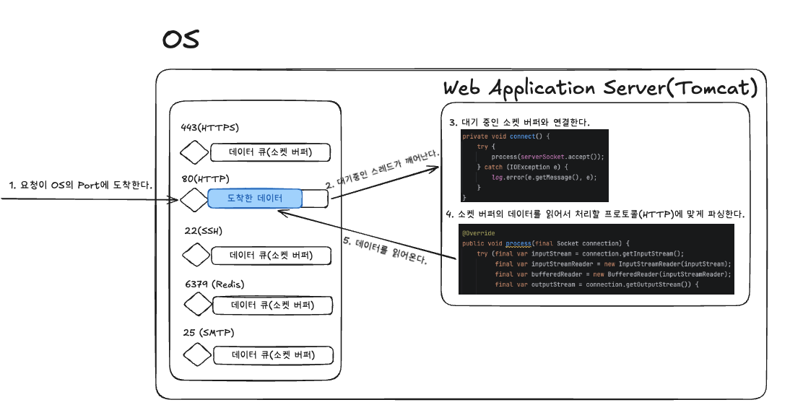

## 책임 분리 기준

## Web Application Server vs Web Server

공통점: Application Layer Protocol을 처리한다. (HTTP, TLS, SMTP ..)
차이점:

- Web Server는 이미 존재하는 리소스를 제공하거나 전달한다.
- WAS는 애플리케이션 코드를 실행해서 요청을 가공하여 응답한다.

WAS는 Application Layer Protocol을 처리하는 기능과 더불어, 애플리케이션 자체 로직이 수행되어야 한다.
현재 패키지가 분리된 구조로 그 책임 경계를 구분할 수 있다.
(HTTP 처리는 org.apache.coyote, 유저 로직 처리는 com.techcourse)



## 웹 요청부터 응답까지의 과정

1. 각 프로세스는 자신이 처리할 데이터를 읽기 위해 대기(Listen)한다.
   ```java
   // 대기 중인 tomcat 프로세스
    @Override
    public void run() {
        // 클라이언트가 연결될때까지 대기한다.
        while (!stopped) {
            connect();
        }
    }
    ```
2. 요청(바이트 스트림)이 OS의 포트와 연결된 소켓 버퍼에 저장된다.
3. 소켓 버퍼에 데이터가 도착하면, 운영체제는 응답을 대기 중인 스레드를 깨운다.
3. 깨어난 스레드(현 프로젝트는 tomcat)는 소켓 버퍼의 바이트 스트림을 읽어 요청을 처리한다.

    ```java
    // 대기 중인 포트의 소켓과 연결된다.
    private void connect() {
        try {
            process(serverSocket.accept()); // 대기 중인 소켓과 연결
        } catch (IOException e) {
            log.error(e.getMessage(), e);
        }
    }
    ```

5. 소켓 버퍼로 읽어들이는 데이터는 바이트 스트림이며, 이를 잘 활용하기 위해 스트림을 가공한다.

```java
final var inputStream = connection.getInputStream(); // ServerSocket의 connection
final var inputStreamReader = new InputStreamReader(inputStream);
final var bufferedReader = new BufferedReader(inputStreamReader);
```

6. 톰캣은 바이트 스트림을 HTTP 프로토콜에 맞게 바이트 스트림을 파싱한다.
7. 파싱한 HTTP 데이터를 애플리케이션에서 활용하여 비즈니스 로직을 처리한다.
8. 수행한 결과를 HTTP Response로 만들고 응답을 반환한다.

### 요청자는 서버의 포트가 자신이 요청한 프로토콜을 처리할 수 있는지 어떻게 알까?

1. Well-Known Port를 사용하므로 유추가 가능하다.
2. 22, 25, 80 등 포트는 SSH, SMTP, HTTP 를 처리하자고 약속된 포트 번호이다.(약속이지, 강제는 아니다.)
3. 따라서 프로토콜의 Well-Known 포트를 사용하면, 서버에서 해당 프로토콜을 처리할 프로세스가 대기 중임을 기대할 수 있다.