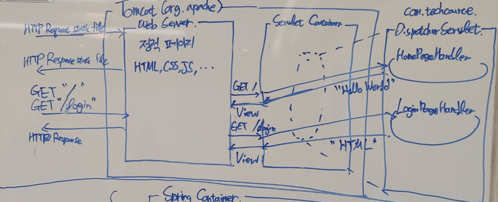

# 1단계 - HTTP 서버 구현하기

- 아래 순서는 구현 순서대로 작성되었습니다.

### 1. GET /index.html 응답하기

- HTTP Start Line 읽기
  - HTTP Request의 첫 번째 줄을 읽는다.
- HTTP Start Line을 요소 별로 구분하기
  - HTTP method, Request Uri, HTTP version으로 구분하기
- HTTP Request 요청 url에 해당되는 파일을 resource 디렉토리에서 읽는다.

### 2. CSS 지원하기

- '.css' 파일을 받았을 경우, `Content-Type: text/css;charset=utf-8;`로 설정
  - '.js', '.csv' 파일의 경우, `text/javascript`, `image/csv+xml`로 설정함

### 리펙터링

- Tomcat 과 Spring MVC의 구조를 참고하여 전반적인 구조를 설정한다.
  1. ServletContainer에 등록된 핸들러로 요청할 경우, View 객체로 처리한다.
  2. 정적 파일을 요청할 경우, Tomcat 내부에서 처리한다.

- 구조도
  

### 3. Query String 파싱

- `/login?account=gugu&password=password`으로 접속하면 로그인 페이지(login.html)를 보여주기
  - 유저 정보('account', 'password')가 레포지토리 정보와 일치할 경우, 로그를 남딘다.

# 3단계 - 리팩터링 (1,2 단계)

### 1. HttpRequest 클래스 구현하기

- HttpRequest에 구성 요소 추가하기
  - Header 추가하기
  - Body 추가하기
- HttpRequest 사용의 편의성을 위해, 빌더 추가하기

### 2. HttpResponse 클래스 구현하기

- HttpResponse 구현하기
  - HttpMethod 추가하기
  - Header 추가하기
  - Body 추가하기
- HttpResponse 사용의 편의성을 위해, 빌더 추가하기

### 기존 구현 변경하기

- `StaticFileResponseUtils`, `ViewResponseUtils` 에서 HttpRespone를 반환하도록 변경
- `HttpResponseWriter`를 도입하여, HttpResponse를 평문으로 바꾸는 작업을 담당함

# 2단계 - 로그인 구현하기

### 1. HTTP Status Code 302

- GET /login 요청이 일어났을 때
  - 쿼리 파라미터 key에 account 또는 password가 없을 경우 -> login.html 페이지를 보여준다
  - 쿼리 파라미터 ket에 account, password가 있을 때
    - 해당 유저가 있을 경우 -> status code를 302, /index.html로 리다이렉트
    - 해당 유저가 없을 경우 -> status code를 302, /401.html로 리다이렉트

### 2. POST 방식으로 회원가입

- GET /register 요청 시
  - register.html 페이지를 보여준다.
- POST /register (Content-Type : application/x-www-form-urlencoded) 요청 시
  - `InMemoryUserRepository`에 회원 가입 실시
  - 회원 가입이 완료되면 /index.html로 리다이렉트

### 3. Cookie에 JSESSIONID 값 저장하기
- 로그인에 성공하면 쿠키와 세션을 활용해서 로그인 상태를 유지하기
  - GET /login 에서 로그인 성공 시, UUID 값을 쿠키로 발급한다.
  - POST /register 에서 로그인 성공 시, UUID 값을 쿠키로 발급한다.
- 쿠키 발급 방법
  - Response Header에 `Set-Cookie: JSESSIONID=656cef62-e3c4-40bc-a8df-94732920ed46` 형식으로 추가
  - `UUID uuid = UUID.randomUUID()`로 UUID를 발급한다.
  - HTTP Request Header의 Cookie에 JSESSIONID가 없으면 HTTP Response Header에 Set-Cookie를 반환해주는 기능을 구현한다.

### 4. Session 구현하기
- 로그인에 성공하면 SessionStorege에 Session 객체의 값으로 User 객체를 저장
- JSESSIONID의 값으로 로그인 여부를 체크
- GET /login 로 접근하면 이미 로그인한 상태니 index.html 페이지로 리다이렉트
